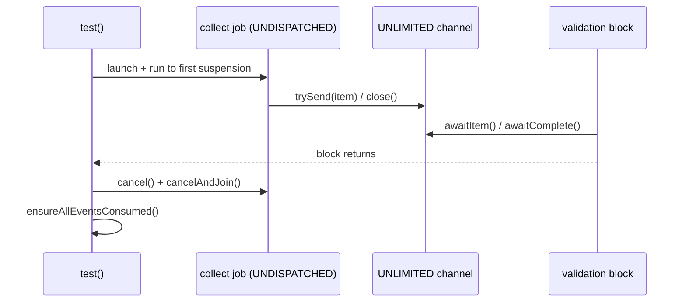
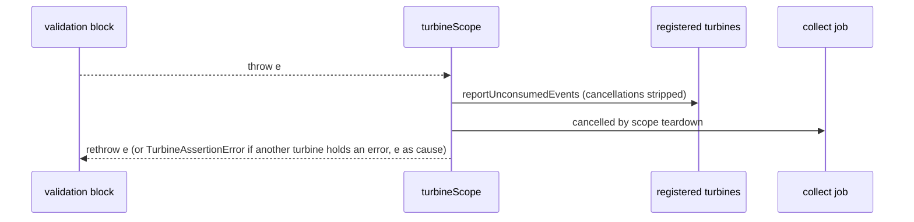
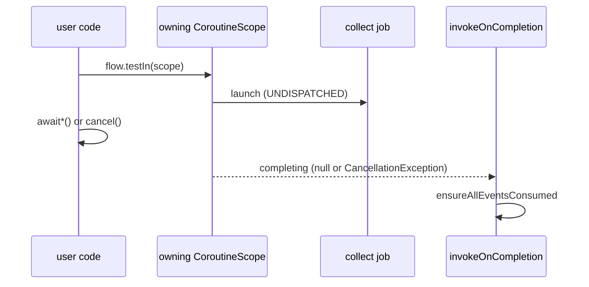

# Turbine

Turbine is a small testing library for kotlinx.coroutines
[`Flow`](https://kotlin.github.io/kotlinx.coroutines/kotlinx-coroutines-core/kotlinx.coroutines.flow/-flow/).

```kotlin
flowOf("one", "two").test {
  assertEquals("one", awaitItem())
  assertEquals("two", awaitItem())
  awaitComplete()
}
```

> A turbine is a rotary mechanical device that extracts energy from a fluid flow and converts it into useful work.
>
> – [Wikipedia](https://en.wikipedia.org/wiki/Turbine)

## Download

```kotlin
repositories {
  mavenCentral()
}
dependencies {
  testImplementation("app.cash.turbine:turbine:1.2.1")
}
```

<details>
<summary>Snapshots of the development version are available in the Central Portal Snapshots repository.</summary>
<p>

```kotlin
repositories {
  maven {
    url = uri("https://central.sonatype.com/repository/maven-snapshots/")
  }
}
dependencies {
  testImplementation("app.cash.turbine:turbine:1.3.0-SNAPSHOT")
}
```

</p>
</details>

While Turbine's own API is stable, we are currently forced to depend on an unstable API from
kotlinx.coroutines test artifact: `UnconfinedTestDispatcher`. Without this usage of Turbine with
`runTest` would break. It's possible for future coroutine library updates to alter the behavior of
this library as a result. We will make every effort to ensure behavioral stability as well until this
API dependency is stabilized (tracking [issue #132](https://github.com/cashapp/turbine/issues/132)).

## Usage

A `Turbine` is a thin wrapper over a `Channel` with an API designed for testing.

You can call `awaitItem()` to suspend and wait for an item to be sent to the `Turbine`:

```kotlin
assertEquals("one", turbine.awaitItem())
```

...`awaitComplete()` to suspend until the `Turbine` completes without an exception:

```kotlin
turbine.awaitComplete()
```

...or `awaitError()` to suspend until the `Turbine` completes with a `Throwable`.

```kotlin
assertEquals("broken!", turbine.awaitError().message)
```

If `await*` is called and nothing happens, `Turbine` will timeout and fail instead of hanging.

When you are done with a `Turbine`, you can clean up by calling `cancel()` to terminate any backing coroutines.
Finally, you can assert that all events were consumed by calling `ensureAllEventsConsumed()`.


### Single Flow

The simplest way to create and run a `Turbine` is produce one from a `Flow`.
To test a single `Flow`, call the `test` extension:

```kotlin
someFlow.test {
  // Validation code here!
}
```

`test` launches a new coroutine, calls `someFlow.collect`, and feeds the results into a `Turbine`.
Then it calls the validation block, passing in the read-only `ReceiveTurbine` interface as a receiver:

```kotlin
flowOf("one").test {
  assertEquals("one", awaitItem())
  awaitComplete()
}
```

When the validation block is complete, `test` cancels the coroutine and calls `ensureAllEventsConsumed()`.

### Multiple Flows

To test multiple flows, assign each `Turbine` to a separate `val` by calling `testIn` instead:

```kotlin
runTest {
  turbineScope {
    val turbine1 = flowOf(1).testIn(backgroundScope)
    val turbine2 = flowOf(2).testIn(backgroundScope)
    assertEquals(1, turbine1.awaitItem())
    assertEquals(2, turbine2.awaitItem())
    turbine1.awaitComplete()
    turbine2.awaitComplete()
  }
}
```

Like `test`, `testIn` produces a `ReceiveTurbine`.
`ensureAllEventsConsumed()` will be invoked when the calling coroutine completes.

`testIn` cannot automatically clean up its coroutine, so it is up to you to ensure that the running flow terminates.
Use `runTest`'s `backgroundScope`, and it will take care of this automatically.
Otherwise, make sure to call one of the following methods before the end of your scope:

* `cancel()`
* `awaitComplete()`
* `awaitError()`

Otherwise, your test will hang.

### Consuming All Events

Failing to consume all events before the end of a flow-based `Turbine`'s validation block will fail your test:

```kotlin
flowOf("one", "two").test {
  assertEquals("one", awaitItem())
}
```
```
Exception in thread "main" AssertionError:
  Unconsumed events found:
   - Item(two)
   - Complete
```

The same goes for `testIn`, but at the end of the calling coroutine:

```kotlin
runTest {
  turbineScope {
    val turbine = flowOf("one", "two").testIn(backgroundScope)
    assertEquals("one", turbine.awaitItem())
  }
}
```
```
Exception in thread "main" AssertionError:
  Unconsumed events found:
   - Item(two)
   - Complete
```

Received events can be explicitly ignored, however.

```kotlin
flowOf("one", "two").test {
  assertEquals("one", awaitItem())
  cancelAndIgnoreRemainingEvents()
}
```

Additionally, we can receive the most recent emitted item and ignore the previous ones.

```kotlin
flowOf("one", "two", "three")
  .map {
    delay(100)
    it
  }
  .test {
    // 0 - 100ms -> no emission yet
    // 100ms - 200ms -> "one" is emitted
    // 200ms - 300ms -> "two" is emitted
    // 300ms - 400ms -> "three" is emitted
    delay(250)
    assertEquals("two", expectMostRecentItem())
    cancelAndIgnoreRemainingEvents()
  }
```


### Flow Termination

Flow termination events (exceptions and completion) are exposed as events which must be consumed for validation.
So, for example, throwing a `RuntimeException` inside of your `flow` will not throw an exception in your test.
It will instead produce a Turbine error event:

```kotlin
flow { throw RuntimeException("broken!") }.test {
  assertEquals("broken!", awaitError().message)
}
```

Failure to consume an error will result in the same unconsumed event exception as above, but
with the exception added as the cause so that the full stacktrace is available.

```kotlin
flow<Nothing> { throw RuntimeException("broken!") }.test { }
```
```
app.cash.turbine.TurbineAssertionError: Unconsumed events found:
 - Error(RuntimeException)
	at app//app.cash.turbine.ChannelTurbine.ensureAllEventsConsumed(Turbine.kt:215)
  ... 80 more
Caused by: java.lang.RuntimeException: broken!
	at example.MainKt$main$1.invokeSuspend(FlowTest.kt:652)
	... 105 more
```

### Standalone Turbines

In addition to `ReceiveTurbine`s created from flows, standalone `Turbine`s can be used to communicate with test code outside of a flow.
Use them everywhere, and you might never need `runCurrent()` again.
Here's an example of how to use `Turbine()` in a fake:

```kotlin
class FakeNavigator : Navigator {
  val goTos = Turbine<Screen>()

  override fun goTo(screen: Screen) {
    goTos.add(screen)
  }
}
```
```kotlin
runTest {
  val navigator = FakeNavigator()
  val events: Flow<UiEvent> =
    MutableSharedFlow<UiEvent>(extraBufferCapacity = 50)
  val models: Flow<UiModel> =
    makePresenter(navigator).present(events)
  models.test {
    assertEquals(UiModel(title = "Hi there"), awaitItem())
    events.emit(UiEvent.Close)
    assertEquals(Screens.Back, navigator.goTos.awaitItem())
  }
}
```

### Standalone Turbine Compat APIs

To support codebases with a mix of coroutines and non-coroutines code, standalone `Turbine` includes non-suspending compat APIs.
All the `await` methods have equivalent `take` methods that are non-suspending:

```kotlin
val navigator = FakeNavigator()
val events: PublishRelay<UiEvent> = PublishRelay.create()

val models: Observable<UiModel> =
  makePresenter(navigator).present(events)
val testObserver = models.test()
testObserver.assertValue(UiModel(title = "Hi there"))
events.accept(UiEvent.Close)
assertEquals(Screens.Back, navigator.goTos.takeItem())
```

Use `takeItem()` and friends, and `Turbine` behaves like simple queue; use `awaitItem()` and friends, and it's a `Turbine`.

These methods should only be used from a non-suspending context.
On JVM platforms, they will throw when used from a suspending context.

### Asynchronicity and Turbine

Flows are asynchronous by default. Your flow is collected concurrently by Turbine alongside your test code.

Handling this asynchronicity works the same way with Turbine as it does in production coroutines code:
instead of using tools like `runCurrent()` to "push" an asynchronous flow along, `Turbine`'s `awaitItem()`, `awaitComplete()`, and `awaitError()` "pull" them along by parking until a new event is ready.

```kotlin
channelFlow {
  withContext(IO) {
    Thread.sleep(100)
    send("item")
  }
}.test {
  assertEquals("item", awaitItem())
  awaitComplete()
}
```

Your validation code may run concurrently with the flow under test, but Turbine puts it in the driver's seat as much as possible:
`test` will end when your validation block is done executing, implicitly cancelling the flow under test.

```kotlin
channelFlow {
  withContext(IO) {
    repeat(10) {
      Thread.sleep(200)
      send("item $it")
    }
  }
}.test {
  assertEquals("item 0", awaitItem())
  assertEquals("item 1", awaitItem())
  assertEquals("item 2", awaitItem())
}
```

Flows can also be explicitly canceled at any point.

```kotlin
channelFlow {
  withContext(IO) {
    repeat(10) {
      Thread.sleep(200)
      send("item $it")
    }
  }
}.test {
  Thread.sleep(700)
  cancel()

  assertEquals("item 0", awaitItem())
  assertEquals("item 1", awaitItem())
  assertEquals("item 2", awaitItem())
}
```

### Names

Turbines can be named to improve error feedback.
Pass in a `name` to `test`, `testIn`, or `Turbine()`, and it will be included in any errors that are thrown:

```kotlin
runTest {
  turbineScope {
    val turbine1 = flowOf(1).testIn(backgroundScope, name = "turbine 1")
    val turbine2 = flowOf(2).testIn(backgroundScope, name = "turbine 2")
    turbine1.awaitComplete()
    turbine2.awaitComplete()
  }
}
```
```
Expected complete for turbine 1 but found Item(1)
app.cash.turbine.TurbineAssertionError: Expected complete for turbine 1 but found Item(1)
	at app//app.cash.turbine.ChannelKt.unexpectedEvent(channel.kt:258)
	at app//app.cash.turbine.ChannelKt.awaitComplete(channel.kt:226)
	at app//app.cash.turbine.ChannelKt$awaitComplete$1.invokeSuspend(channel.kt)
	at app//kotlin.coroutines.jvm.internal.BaseContinuationImpl.resumeWith(ContinuationImpl.kt:33)
	...
```

### Order of Execution & Shared Flows

Shared flows are sensitive to order of execution.
Calling `emit` before calling `collect` will drop the emitted value:

```kotlin
val mutableSharedFlow = MutableSharedFlow<Int>(replay = 0)
mutableSharedFlow.emit(1)
mutableSharedFlow.test {
  assertEquals(awaitItem(), 1)
}
```
```
No value produced in 1s
java.lang.AssertionError: No value produced in 1s
	at app.cash.turbine.ChannelKt.awaitEvent(channel.kt:90)
	at app.cash.turbine.ChannelKt$awaitEvent$1.invokeSuspend(channel.kt)
	(Coroutine boundary)
	at kotlinx.coroutines.test.TestBuildersKt__TestBuildersKt$runTestCoroutine$2.invokeSuspend(TestBuilders.kt:212)
```

Turbine's `test` and `testIn` methods guarantee that the flow under test will run up to the first suspension point before proceeding.
So calling `test` on a shared flow _before_ emitting will not drop:

```kotlin
val mutableSharedFlow = MutableSharedFlow<Int>(replay = 0)
mutableSharedFlow.test {
  mutableSharedFlow.emit(1)
  assertEquals(awaitItem(), 1)
}
```

If your code collects on shared flows, ensure that it does so promptly to have a lovely experience.

The shared flow types Kotlin currently provides are:
* `MutableStateFlow`
* `StateFlow`
* `MutableSharedFlow`
* `SharedFlow`

### Lifecycle Anatomy

`test`, `testIn`, standalone `Turbine()`, and the `ReceiveChannel` extensions all share one event
model — the sealed `Event` type (`Item`, `Complete`, `Error`) — but they differ in who starts
collection, who cancels it, who observes exceptions, and when `ensureAllEventsConsumed` runs.

The internal lifecycle recorder observes these transitions without changing behavior; the
deterministic tests that pin each timeline live in
`LifecycleTest` (common) and `LifecycleJvmTest` (JVM-only assertions).

**Entry points and ownership**

| Entry point | Collection starts | Cancelled by | Unconsumed check | Exceptions observed by |
| --- | --- | --- | --- | --- |
| `Flow.test { }` | Before the block runs, on a `UNDISPATCHED` child job | `test` when the block returns (`cancel()` + `join`) | `test` after cancel | Validation block directly; upstream failures become `Event.Error`, or an assertion with the failure as `cause` if unconsumed |
| `Flow.testIn(scope)` | Before the call returns, on a job launched in `scope` | Caller (`cancel`) or the owning scope ending | An `invokeOnCompletion` handler when the scope finishes | Caller through `awaitError()`; otherwise a scope-completion assertion (`CompletionHandlerException` wrapping the `AssertionError`) |
| `Turbine()` | Never — there is no collector | Caller only | Caller (`ensureAllEventsConsumed`) | Caller (`awaitError()` / `expectMostRecentItem()`) |
| `ReceiveChannel` extensions (`await*`, `take*`) | Never | None — the raw channel is used as-is | Never | Caller directly (an `Error` event throws from the await) |

**`Flow.test` normal completion**



Pinned by `testStartsCollectorUndispatchedThenCancelsAndVerifiesOnNormalCompletion`. The collector
job finishes immediately after `close()`, so for a fast upstream the job is already completed
before the block's first await; the unconditional end-of-block `cancel()` is then a no-op join.

**Validation block throws**



Pinned by `testBlockThrowingIsRethrownDirectlyAndCancelsCollector` (the throwable is rethrown as-is)
and `validationBlockFailureWithUpstreamErrorWrapsButKeepsBothVisible`.

**`testIn` scope exit**



Pinned by `testInForegroundScopeCollectsUntilAwaitCompleteAndChecksOnScopeExit`,
`testInForegroundScopeUnconsumedItemFailsWhenScopeIsCancelled`, and
`testInBackgroundScopeIsStillAliveWhenTurbineScopeExits` for `runTest`'s `backgroundScope`, which is
cancelled only during `runTest` teardown.

**Four distinct terminal states**

1. *Terminal event enqueued but not consumed* — `Complete`/`Error` sits in the unlimited buffer;
   `ChannelClosed` is recorded but the collector job has typically completed already. Pinned by
   `stateOneTerminalEventEnqueuedButNotConsumed`.
2. *Collection job completed* — observable as `JobCompleted(cancelled=false)`; a later `cancel()`
   joins a finished job. Pinned by `stateTwoCollectorJobCompletedIsObservableAndLaterCancelIsANoOpJoin`.
3. *ReceiveTurbine cancelled while upstream is alive* — `cancel()` marks terminal events ignored
   *before* the channel closes, so a terminal event produced by the cancelled collector is not
   reported. Pinned by `stateThreeCancelledTurbineDoesNotReportTerminalEvents`.
4. *Owning scope finished* — the `testIn` completion handler runs the check exactly once at scope
   exit. Pinned by `stateFourScopeFinishedChecksTestInTurbines`.

**Buffered terminal events and the two consuming cancels**

* `cancelAndIgnoreRemainingEvents()` never drains the buffer: it sets the ignore flag, cancels and
  joins, and the unconsumed report short-circuits. A buffered `Error` is swallowed (not thrown),
  and a buffered `Complete` is not reported. Pinned by
  `ignoreCancelOnBufferedCompleteDoesNotDrainAndNeverThrows`,
  `ignoreCancelOnBufferedErrorSwallowsTheError`.
* `cancelAndConsumeRemainingEvents()` first non-blockingly drains every buffered event up to and
  including the terminal event, returns them as `List<Event<T>>`, then cancels. The returned
  `Event.Error` carries the upstream throwable; the subsequent report is empty. Pinned by
  `consumeCancelOnBufferedCompleteDrainsAndReturnsComplete` and
  `consumeCancelOnBufferedItemsAndErrorDrainsIncludingError`.

Calling plain `cancel()` after the channel was *already closed* does not retroactively suppress the
buffered terminal event (`stateOneTerminalEventEnqueuedButNotConsumed`); suppression only happens
when cancel wins the race (`stateThreeCancelledTurbineDoesNotReportTerminalEvents`).

**Exception causes**

* An unconsumed upstream `Error` produces an `AssertionError` whose `cause` is the upstream
  throwable (`unconsumedUpstreamErrorAssertionCarriesErrorAsCauseNotSuppressed`).
* A `testIn` scope-exit assertion surfaces as a `CompletionHandlerException` wrapping the
  `AssertionError`; it does not replace the scope's cancellation
  (`scopeCancellationSuppressesUnconsumedEventAssertion`).

**Implementation map**

* Collector job and send/close lifecycle: `collectTurbineIn` in `flow.kt`.
* `test`/`testIn` ownership and the scope-exit handler: `flow.kt`.
* Cancellation, draining, and the unconsumed report: `ChannelTurbine` in `Turbine.kt`.
* Await timeout selection and the wall-clock/virtual split: `awaitEvent`,
  `withAppropriateTimeout`, `withWallclockTimeout` in `channel.kt`; timeout elements and
  `resolveTimeout` in `coroutines.kt`.

### Timeouts

Turbine applies a timeout whenever it waits for an event.
This is a wall clock time timeout that ignores `runTest`'s virtual clock time.

The default timeout length is three seconds. This can be overridden by passing a timeout duration to `test`:

```kotlin
flowOf("one", "two").test(timeout = 10.milliseconds) {
  ...
}
```

This timeout will be used for all Turbine-related calls inside the validation block.

You can also override the timeout for Turbines created with `testIn` and `Turbine()`:

```kotlin
val standalone = Turbine<String>(timeout = 10.milliseconds)
val flow = flowOf("one").testIn(
  scope = backgroundScope,
  timeout = 10.milliseconds,
)
```

These timeout overrides only apply to the `Turbine` on which they were applied.

Finally, you can also change the timeout for a whole block of code using `withTurbineTimeout`:

```kotlin
withTurbineTimeout(10.milliseconds) {
  ...
}
```

Timeout resolution for each `await*` call follows this precedence, strongest first:

1. An explicit `timeout` parameter on the `Turbine` instance (`Turbine(timeout=…)`,
   `testIn(timeout=…)`) or installed by `test(timeout=…)` for its whole block.
2. The nearest `withTurbineTimeout` element in the coroutine context.
3. The built-in default of three seconds.

Pinned by `timeoutDefaultsToThreeSecondsAndWallClockUnderRunTest`,
`timeoutFromContextElement`, `explicitTurbineParameterBeatsContextAndDefault`,
`explicitTestParameterBeatsNestedContext`, and `explicitTestInParameterBeatsContext`.

The timing mechanism is chosen from the calling context, not from the timeout source: when a
`TestCoroutineScheduler` is present, a virtual-time `withTimeout` would never elapse, so Turbine
races the await against a real-time `delay` on `Dispatchers.Default` and cancels the await when it
wins; without a scheduler a normal virtual-time `withTimeout` is used. The wall-clock path wraps
its timeout failure in a `TurbineAssertionError` whose cause is the internal
`TurbineTimeoutCancellationException`
(`wallClockTimeoutAssertionWrapsTurbineTimeoutCancellationAsCause`).
Draining events is linear in the number of buffered events (`cancelAndConsumeRemainingEvents` and
the unconsumed report both read until the terminal event, at most once per buffered event).

### Channel Extensions

Most of Turbine's APIs are implemented as extensions on `Channel`.
The more limited API surface of `Turbine` is usually preferable, but these extensions are also available as public APIs if you need them.

# License

    Copyright 2018 Square, Inc.

    Licensed under the Apache License, Version 2.0 (the "License");
    you may not use this file except in compliance with the License.
    You may obtain a copy of the License at

       http://www.apache.org/licenses/LICENSE-2.0

    Unless required by applicable law or agreed to in writing, software
    distributed under the License is distributed on an "AS IS" BASIS,
    WITHOUT WARRANTIES OR CONDITIONS OF ANY KIND, either express or implied.
    See the License for the specific language governing permissions and
    limitations under the License.
